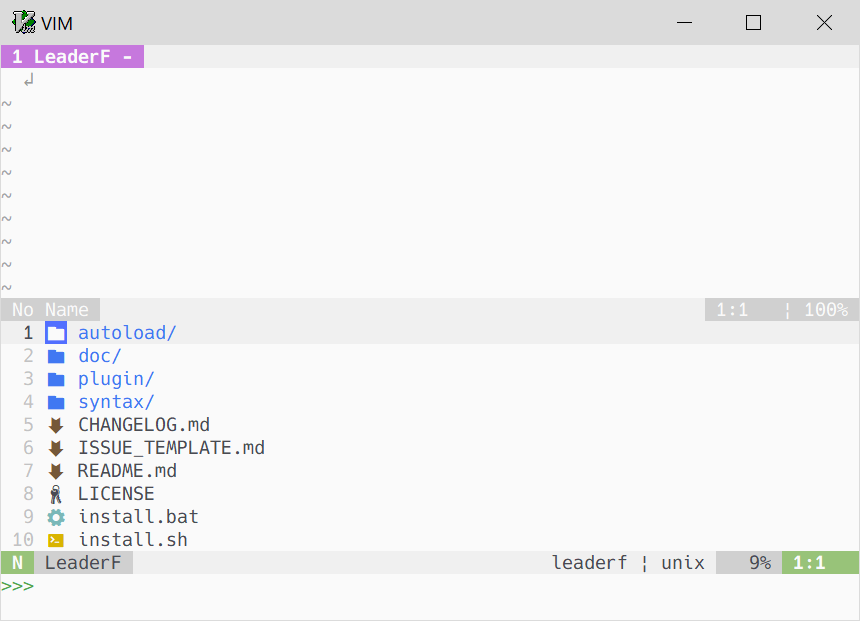
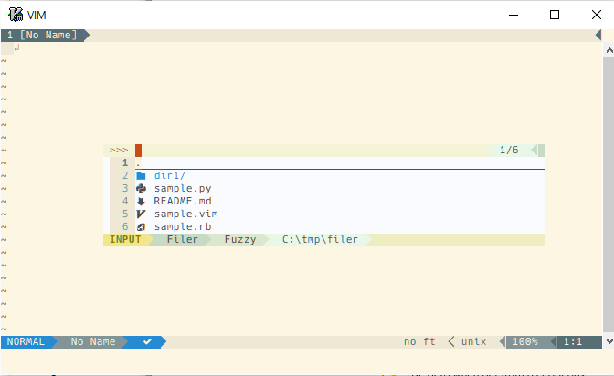
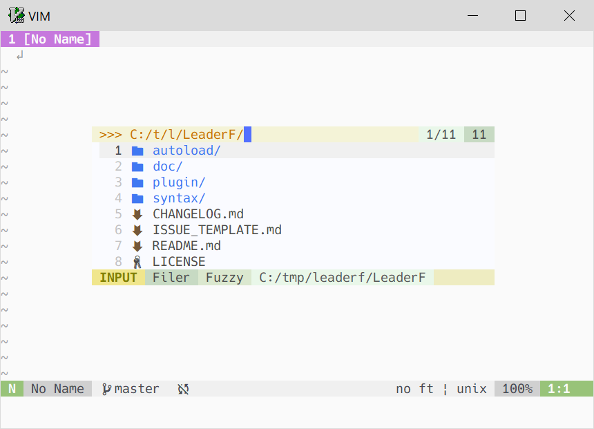

# LeaderF-filer

This Plugin use [LeaderF](https://github.com/Yggdroot/LeaderF) to navigate the files in directory.

Inspired by [vim-clap's filer provider](https://github.com/liuchengxu/vim-clap/pull/272), [helm's find-files](https://github.com/emacs-helm/helm).


## Installation

```
Plug 'Yggdroot/LeaderF'
Plug 'tamago324/LeaderF-filer'
```

## Usage

```
:LeaderfFiler
```
or
```
:Leaderf filer
```

Popup

```
:Leaderf filer --popup
```

## Configuration

see `:h LeaderF-filer-mapping`

### Example

```vim
" ====================
" show devicons
" ====================
call plug#begin('~/vimfiles/plugged')

Plug 'Yggdroot/LeaderF'
Plug 'tamago324/LeaderF-filer'

call plug#end()

" default value 1
let g:Lf_ShowDevIcons = 1

" show path in prompt
let g:Lf_FilerShowPromptPath = 1

" ====================
" customize mappings
" ====================

" To map everything yourself without using the default mapping:

" normal mode
let g:Lf_FilerUseDefaultNormalMap = 0
let g:Lf_FilerNormalMap = {
\   'h':             'open_parent',
\   'l':             'open_current',
\   '<C-h>':         'open_parent',
\   '<C-l>':         'open_current',
\   '~':             'goto_root_marker_dir',
\   '.':             'toggle_hidden_files',
\   'j':             'down',
\   'k':             'up',
\   '<F1>':          'toggle_help',
\   '<Tab>':         'switch_insert_mode',
\   'i':             'switch_insert_mode',
\   'p':             'preview',
\   'q':             'quit',
\   '<C-q>':         'quit',
\   'o':             'accept',
\   '<CR>':          'accept',
\   '<C-s>':         'accept_horizontal',
\   '<C-v>':         'accept_vertical',
\   '<C-t>':         'accept_tab',
\   '<C-Up>':        'page_up_in_preview',
\   '<C-Down>':      'page_down_in_preview',
\   '<Esc>':         'close_preview_popup',
\   's':             'add_selections',
\   '<C-a>':         'select_all',
\   '<F3>':          'clear_selections',
\   'K':             'mkdir',
\   'R':             'rename',
\   'C':             'copy',
\   'P':             'paste',
\   'O':             'create_file',
\   '@':             'change_directory',
\}

" insert mode
let g:Lf_FilerUseDefaultInsertMap = 0
let g:Lf_FilerInsertMap = {
\   '<C-h>':        'open_parent_or_backspace',
\   '<C-l>':        'open_current',
\   '<C-y>':        'toggle_hidden_files',
\   '<C-g>':        'goto_root_marker_dir',
\   '<Esc>':        'quit',
\   '<C-c>':        'quit',
\   '<CR>':         'accept',
\   '<C-s>':        'accept_horizontal',
\   '<C-v>':        'accept_vertical',
\   '<C-t>':        'accept_tab',
\   '<C-r>':        'toggle_regex',
\   '<BS>':         'backspace',
\   '<C-u>':        'clear_line',
\   '<C-w>':        'delete_left_word',
\   '<C-d>':        'delete',
\   '<C-o>':        'paste',
\   '<C-a>':        'home',
\   '<C-e>':        'end',
\   '<C-b>':        'left',
\   '<C-f>':        'right',
\   '<C-j>':        'down',
\   '<C-k>':        'up',
\   '<C-p>':        'prev_history',
\   '<C-n>':        'next_history',
\   '<C-q>':        'preview',
\   '<Tab>':        'switch_normal_mode',
\   '<C-Up>':       'page_up_in_preview',
\   '<C-Down>':     'page_down_in_preview',
\   '<ScroollWhellUp>': 'up3',
\   '<ScroollWhellDown>': 'down3',
\}

" Customize normal mode mapping using g:Lf_NormalMap
let g:Lf_NormalMap = get(g:, 'Lf_NormalMap', {})
let g:Lf_NormalMap = {'Filer':   [['B', ':LeaderfBookmark<CR>']]}
```

## Screenshots

`:Leaderf filer`



`:Leaderf filer --popup`



`let g:Lf_FilerShowPromptPath = 1`



## Credit

* LeaderF-filer uses some code from [defx.nvim](https://github.com/Shougo/defx.nvim).

## License

Apache-2.0
